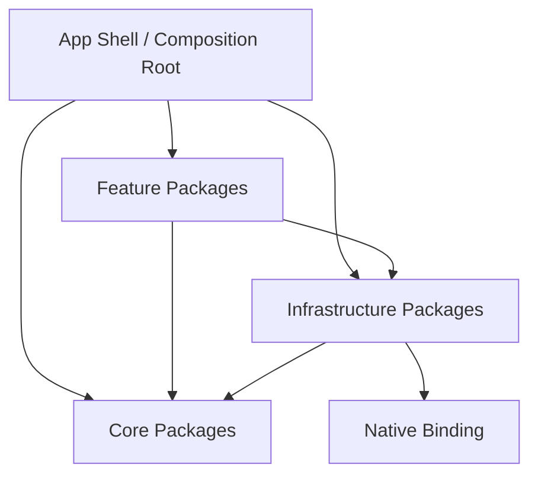

最新更新时间：2026-09-07

# 模块依赖审计

本文件记录 Step 32 的最终依赖审计结果。审计对象是根 `pubspec.yaml` 明确列出的
22 个 workspace 成员，依赖边只统计各 Package `dependencies` 中指向另一个
workspace 成员的直接生产依赖。

## 审计命令

```bash
dart run tool/check_module_dependencies.dart
dart run test/tool/module_dependency_check_test.dart
dart run tool/architecture_check.dart
```

当前结果：依赖审计通过，未发现禁止的层级依赖或循环依赖。成员清单与直接
生产依赖以根 `pubspec.yaml` 和顶部审计命令的当前输出为准。



允许 App Shell 组合 Feature、Core 和 Infrastructure。Feature 可以消费公共
Core Contract 或 Infrastructure Capability；Core/Infrastructure 不得反向引用
Feature。Feature 之间默认禁止直接依赖，当前唯一登记的例外是
`feature_ai -> feature_playbook`，AI 只通过 Playbook 的公开
`PlaybookAutomationPort` 能力边界调用它。

## Package 清单与内部依赖

| 层级 | Package | 内部生产依赖 | 边界说明 |
| --- | --- | --- | --- |
| App | `ssh_mobile` | `app_core`, `app_ui`, `connection_core`, `feature_ai`, `feature_connection`, `feature_developer`, `feature_lan_share`, `feature_mcp`, `feature_monitoring`, `feature_playbook`, `feature_rag`, `feature_sftp`, `feature_system_admin`, `feature_terminal`, `feature_webview`, `network_sdk`, `network_transport`, `ssh_core`, `ssh_mobile_network_native` | Full App 组合根，负责注入 App Scope 与 Feature Route |
| App | `ssh_mobile_terminal` | `app_core`, `app_ui`, `connection_core`, `feature_terminal`, `network_transport`, `ssh_core` | Terminal-only 组合根；不加载 Connection editor Feature |
| Core | `app_core` | 无 | 生命周期、日志和公共能力契约 |
| Core | `app_ui` | 无 | 共享主题、响应式指标和通用 UI |
| Core | `connection_core` | `app_core` | Connection 模型、Repository、数据库和凭据契约 |
| Feature | `feature_ai` | `app_core`, `app_ui`, `connection_core`, `feature_playbook`, `ssh_core` | AI 通过公开 Playbook Automation Capability 调用 Playbook |
| Feature | `feature_connection` | `app_core`, `connection_core` | Connection 编辑器和路由状态 |
| Feature | `feature_developer` | `app_core`, `app_ui` | Developer Log、诊断和浮动面板 |
| Feature | `feature_lan_share` | `app_core`, `app_ui`, `network_sdk`, `network_transport` | LAN Control V2 只消费公共 Network SDK/Capability；App Shell 注入共享 NetworkFacade、NetworkIdentity 和 Runtime，Feature 不创建 native socket/FFI/runtime |
| Feature | `feature_mcp` | `app_core`, `app_ui` | MCP 服务、审批和活动记录 |
| Feature | `feature_monitoring` | `app_core`, `connection_core`, `ssh_core` | 监控业务代码不依赖共享 UI；展示由调用方组合 |
| Feature | `feature_playbook` | `app_core`, `app_ui`, `connection_core`, `ssh_core` | Playbook 执行、审批和运行记录 |
| Feature | `feature_rag` | `app_core`, `app_ui` | RAG 检索、元数据和有界缓存 |
| Feature | `feature_sftp` | `app_core`, `app_ui`, `ssh_core` | SFTP 路由、路径记录和 SSH 能力 |
| Feature | `feature_system_admin` | `app_core`, `app_ui`, `connection_core`, `ssh_core` | 系统管理路由和管理命令 |
| Feature | `feature_terminal` | `app_core`, `app_ui`, `ssh_core` | Terminal UI、路由状态和历史记录 |
| Feature | `feature_webview` | `app_core`, `app_ui` | WebView 会话与安全策略 |
| Infrastructure | `network_transport` | `app_core`, `ssh_mobile_network_native` | App Scope 网络门面和 Native handle 适配器 |
| Infrastructure | `network_sdk` | 无 | Flutter 层 Bootstrap、鉴权 API、Session、事件流客户端及注入式 JSON 适配 |
| Infrastructure | `realtime_media` | 无 | 不透明屏幕媒体端点的 Dart 生命周期契约；不拥有 Runtime、采集、编解码或渲染实现 |
| Infrastructure | `ssh_core` | `app_core`, `connection_core` | SSH Session、Pool、Client 和 Host Key 契约 |
| Infrastructure | `ssh_mobile_network_native` | 无 | Dart/FFI Native 网络绑定 |

## 规则与后续维护

- `feature-to-feature`：Feature 依赖另一 Feature 必须命中
  `architectureAllowlist`，并说明公共 Contract/Capability 边界。
- `lower-layer-to-feature`：Core 或 Infrastructure 依赖 Feature 时失败。
- `dependency-cycle`：任意 workspace 内部生产依赖环时失败。
- `cross-package-src`：跨 Package 导入 `/src/` 由
  `tool/architecture_check.dart` 单独守卫，本工具不重复解析源码。
- Step 32 还清理了两条经过源码审计确认未使用的 manifest 边：
  `feature_monitoring -> app_ui` 和
  `ssh_mobile_terminal -> feature_connection`。

新增或移动 Package 时，必须先更新根 workspace，再运行本文件顶部的三个命令；
如果新增 Feature 之间的公共能力，优先新增 Core/Capability 边界，只有经过架构
评审后才能加入 Allowlist。
